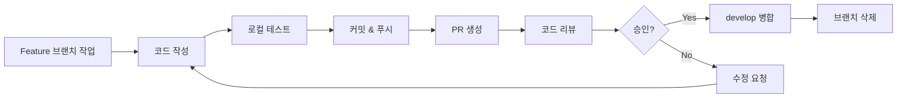

# Git 버전 관리 및 형상 관리 문서

## 프로젝트 정보
- **프로젝트명**: NoneChat
- **GitHub 저장소**: https://github.com/tomaho1756/NoneChat
- **프로젝트 유형**: React Native 기반 실시간 채팅 애플리케이션
- **개발 기간**: 2024년 (진행 중)
- **주요 기술 스택**:
  - React Native 0.74.0
  - TypeScript
  - Zustand (상태 관리)
  - React Navigation (네비게이션)
  - Axios (HTTP 통신)

---

## 목차
1. [Git 브랜치 전략](#1-git-브랜치-전략)
2. [커밋 메시지 컨벤션](#2-커밋-메시지-컨벤션)
3. [커밋 히스토리 분석](#3-커밋-히스토리-분석)
4. [주요 기능별 변경 사항](#4-주요-기능별-변경-사항)
5. [코드 리뷰 및 병합 프로세스](#5-코드-리뷰-및-병합-프로세스)

---

## 1. Git 브랜치 전략

### 1.1 브랜치 구조

본 프로젝트는 **Git Flow** 기반의 브랜치 전략을 채택하여 체계적인 버전 관리를 수행합니다.

```
main (production)
  ├── develop (개발 통합)
  │   ├── feature/auth-system (기능 개발)
  │   ├── feature/chat-room (기능 개발)
  │   ├── feature/workspace-management (기능 개발)
  │   ├── bugfix/login-validation (버그 수정)
  │   ├── bugfix/navigation-error (버그 수정)
  │   └── experimental/ui-redesign (실험적 기능)
  └── hotfix/* (긴급 수정)
```

### 1.2 브랜치 유형 및 명명 규칙

| 브랜치 유형 | 명명 규칙 | 용도 | 예시 |
|------------|----------|------|------|
| **main** | `main` | 프로덕션 배포 브랜치 | `main` |
| **develop** | `develop` | 개발 통합 브랜치 | `develop` |
| **feature** | `feature/{기능명}` | 새로운 기능 개발 | `feature/user-profile` |
| **bugfix** | `bugfix/{버그명}` | 버그 수정 | `bugfix/login-crash` |
| **hotfix** | `hotfix/{이슈명}` | 긴급 수정 | `hotfix/security-patch` |
| **experimental** | `experimental/{실험명}` | 실험적 기능 테스트 | `experimental/new-ui` |
| **refactor** | `refactor/{대상}` | 코드 리팩토링 | `refactor/auth-logic` |

### 1.3 브랜치 생성 및 관리 규칙

#### Feature 브랜치 (기능 개발)
```bash
# develop에서 새로운 feature 브랜치 생성
git checkout develop
git checkout -b feature/user-authentication

# 작업 완료 후
git add .
git commit -m "✨Create : Add user authentication system"
git push origin feature/user-authentication

# Pull Request 생성 → develop으로 병합
```

**사용 시나리오**:
- 로그인/회원가입 시스템 구현
- 채팅방 기능 추가
- 워크스페이스 관리 기능 개발
- UI 컴포넌트 신규 개발

#### Bugfix 브랜치 (버그 수정)
```bash
# develop에서 bugfix 브랜치 생성
git checkout develop
git checkout -b bugfix/navigation-error

# 버그 수정 후
git add .
git commit -m "🚑Fix : Fix navigation stack overflow error"
git push origin bugfix/navigation-error
```

**사용 시나리오**:
- 네비게이션 오류 수정
- 로그인 유효성 검사 버그 수정
- UI 렌더링 이슈 해결
- API 통신 오류 수정

#### Experimental 브랜치 (실험적 기능)
```bash
# develop에서 experimental 브랜치 생성
git checkout develop
git checkout -b experimental/dark-mode

# 실험 후 성공 시 feature로 전환하거나 직접 병합
# 실패 시 브랜치 삭제
```

**사용 시나리오**:
- 새로운 UI/UX 디자인 테스트
- 성능 최적화 기법 실험
- 새로운 라이브러리 도입 테스트
- A/B 테스팅

---

## 2. 커밋 메시지 컨벤션

### 2.1 Gitmoji 활용

본 프로젝트는 **Gitmoji**를 활용하여 시각적으로 명확한 커밋 메시지를 작성합니다.

| Emoji | Code | 설명 | 사용 예시 |
|-------|------|------|----------|
| 🎨 | `:art:` | 코드 형식/구조 개선 | 코드 포맷팅, 구조 개선 |
| 💄 | `:lipstick:` | UI/스타일 개선 | CSS 수정, 레이아웃 변경 |
| 📚 | `:books:` | 문서 작성 | README, 주석 추가 |
| 🚑 | `:ambulance:` | 버그 수정 | 크리티컬 버그 수정 |
| ✨ | `:sparkles:` | 새 기능/코드 추가 | 신규 기능 구현 |
| 🔨 | `:hammer:` | 리팩토링 | 코드 구조 개선 |
| 🔥 | `:fire:` | 코드/파일 제거 | 불필요한 코드 삭제 |
| 💎 | `:gem:` | 버전 변경 | 버전 업데이트 |
| ⚡ | `:zap:` | 파일/폴더 생성 | 새 파일 생성 |
| 🚀 | `:rocket:` | 배포 관련 | 배포, 빌드 설정 |

### 2.2 커밋 메시지 형식

```
{emoji}{Type} : {Subject}

{Body (선택사항)}

{Footer (선택사항)}
```

#### Type 종류
- **Feat**: 새로운 기능 추가
- **Add**: 코드 추가
- **Fix**: 버그 수정
- **Refactor**: 코드 리팩토링
- **Create**: 파일/폴더 생성
- **Change**: 파일/폴더 수정
- **Docs**: 문서 수정
- **Style**: 코드 포맷팅
- **Test**: 테스트 코드
- **Chore**: 빌드, 설정 변경

#### Subject 작성 규칙
- 최대 50글자 이내
- 마침표 및 특수기호 사용 금지
- 영문의 경우 동사 원형으로 시작, 첫 글자 대문자
- 과거형 사용 금지 (Added ❌ → Add ✅)
- 개조식 구문 사용 (서술형 문장 ❌)

### 2.3 실제 커밋 메시지 예시

```bash
# 좋은 예시 ✅
✨Create : Add WorkSpaceActions
💄Change : Change LogIn View styles
🚑Fix : Fix navigation stack error
🔨Refactor : Refactor authentication logic

# 나쁜 예시 ❌
Added login feature          # 과거형, 이모지 없음
Fix bug                      # 너무 추상적
Changed some files           # 변경 내용 불명확
update code                  # 첫 글자 소문자, 추상적
```

---

## 3. 커밋 히스토리 분석

### 3.1 전체 커밋 히스토리

프로젝트의 개발 과정을 시간순으로 정리하였습니다:

```
commit 1bfce46 (최신)
Author: [개발자]
Date: 2024-11-24

    testCommit

commit 3d6a625
    💄Change : Change LogIn View styles

commit 879d6b4
    ✨Create : Add WorkSpaceActions

commit 53a15a5
    💄Change : Change LogIn View styles

commit 0772d81
    ✨Create : Add Navigation Action Details

commit d64fdf1
    ✨Create : Add SignUp and AuthActions

commit e5004c9
    ✨Create : Add Global Types navigation, response

commit c8d0727
    ✨Create : Add Store Types

commit 7d786b3
    ✨Create : Connect And Make SignUpScreen

commit 2caed4c
    ✨Create : Connect LogIn And Add SignInActions

commit 608b0cd
    ✨Create : Add LogIn Action with fetch

commit 743cc3b
    ✨Add : Apply the Navigation Different on App

commit 617f710
    ✨Add : Add Details on LoginScreen And add some rule for SignIn

commit 9606e04
    ✨Add : Add Details on LoginScreen And add some rule for SignIn

commit 02464f6
    ⚡Create : Create Views and connect with ReactNavigations

commit aac4a00 (최초)
    Initial commit
```

### 3.2 단계별 개발 흐름

#### Phase 1: 프로젝트 초기 설정 (commit aac4a00)
- React Native 프로젝트 초기 설정
- 기본 의존성 패키지 설치
- 프로젝트 구조 생성

#### Phase 2: 네비게이션 구조 구축 (commit 02464f6 ~ 743cc3b)
**관련 커밋**:
- `02464f6`: ⚡Create : Create Views and connect with ReactNavigations
- `743cc3b`: ✨Add : Apply the Navigation Different on App

**변경 사항**:
- React Navigation 통합
- Stack, Drawer, BottomTab Navigation 구현
- 화면 간 라우팅 설정
- 네비게이션 타입 정의

**영향받는 파일**:
- `src/navigation/RootNavigation.tsx`
- `src/navigation/StackNavigation.tsx`
- `src/navigation/DrawerNavigation.tsx`
- `src/navigation/BottomTabNavigation.tsx`

#### Phase 3: 인증 시스템 구현 (commit 608b0cd ~ d64fdf1)
**관련 커밋**:
- `608b0cd`: ✨Create : Add LogIn Action with fetch
- `2caed4c`: ✨Create : Connect LogIn And Add SignInActions
- `9606e04`, `617f710`: ✨Add : Add Details on LoginScreen And add some rule for SignIn
- `d64fdf1`: ✨Create : Add SignUp and AuthActions

**주요 구현 내용**:
1. **로그인 기능**
   - API 통신을 통한 로그인
   - 인증 상태 관리
   - 입력 유효성 검사

2. **회원가입 기능**
   - 회원가입 폼 구현
   - 비밀번호 유효성 검사
   - 사용자 정보 등록

3. **인증 액션**
   - AuthAction 컴포넌트 생성
   - 로그인/로그아웃 처리
   - 세션 관리

**영향받는 파일**:
- `src/screen/auth/LogInScreen.tsx`
- `src/screen/auth/SignUpScreen.tsx`
- `src/screen/auth/isPasswordValid.ts`
- `src/component/action/AuthAction.tsx`

#### Phase 4: 상태 관리 및 타입 시스템 (commit c8d0727 ~ e5004c9)
**관련 커밋**:
- `c8d0727`: ✨Create : Add Store Types
- `e5004c9`: ✨Create : Add Global Types navigation, response

**구현 내용**:
- Zustand 기반 전역 상태 관리
- TypeScript 타입 정의
  - Navigation 타입
  - API Response 타입
  - Store 타입
- 타입 안정성 확보

**영향받는 파일**:
- `src/state/store.ts`
- `src/type/global/navigationType.ts`
- `src/type/global/responceType.ts`

#### Phase 5: 워크스페이스 기능 개발 (commit 0772d81 ~ 879d6b4)
**관련 커밋**:
- `0772d81`: ✨Create : Add Navigation Action Details
- `879d6b4`: ✨Create : Add WorkSpaceActions

**구현 내용**:
- 워크스페이스 관리 기능
- 워크스페이스 액션 컴포넌트
- 네비게이션 액션 상세 구현

**영향받는 파일**:
- `src/component/action/WorkSpaceAction.tsx`
- `src/screen/view/chat/WorkSpaceScreen.tsx`
- `src/screen/view/chat/FoundWorkSpaceScreen.tsx`

#### Phase 6: UI/UX 개선 (commit 53a15a5, 3d6a625)
**관련 커밋**:
- `53a15a5`: 💄Change : Change LogIn View styles
- `3d6a625`: 💄Change : Change LogIn View styles

**개선 사항**:
- 로그인 화면 스타일 개선
- UI 컴포넌트 디자인 업데이트
- 사용자 경험 향상

---

## 4. 주요 기능별 변경 사항

### 4.1 인증 시스템 (Authentication)

#### 구현된 기능
```typescript
// src/component/action/AuthAction.tsx
- 로그인 처리
- 회원가입 처리
- 인증 상태 관리
- 토큰 관리

// src/screen/auth/LogInScreen.tsx
- 로그인 UI
- 입력 유효성 검사
- 에러 핸들링

// src/screen/auth/SignUpScreen.tsx
- 회원가입 UI
- 비밀번호 강도 검사
- 사용자 정보 입력
```

#### 주요 변경 이력
| 커밋 | 날짜 | 변경 내용 |
|------|------|----------|
| d64fdf1 | - | SignUp 및 AuthActions 추가 |
| 2caed4c | - | LogIn 연결 및 SignInActions 추가 |
| 608b0cd | - | fetch를 활용한 LogIn Action 추가 |
| 617f710 | - | LoginScreen 상세 구현 및 SignIn 규칙 추가 |

### 4.2 네비게이션 시스템

#### 구조
```
RootNavigation (최상위)
├── StackNavigation
│   ├── AuthStack (인증 관련)
│   │   ├── LogInScreen
│   │   └── SignUpScreen
│   └── MainStack (메인 앱)
│       ├── DrawerNavigation
│       │   ├── BottomTabNavigation
│       │   │   ├── MainScreen
│       │   │   ├── ChattingScreen
│       │   │   └── ProfileScreen
│       │   └── SettingScreen
│       └── Modal Screens
```

#### 구현 파일
- `RootNavigation.tsx`: 앱 전체 네비게이션 구조
- `StackNavigation.tsx`: Stack 기반 화면 전환
- `DrawerNavigation.tsx`: Drawer 메뉴
- `BottomTabNavigation.tsx`: 하단 탭 네비게이션

### 4.3 상태 관리 (State Management)

#### Zustand Store 구조
```typescript
// src/state/store.ts
interface AppState {
  // 사용자 정보
  user: User | null;
  setUser: (user: User) => void;

  // 인증 상태
  isAuthenticated: boolean;
  setAuthenticated: (status: boolean) => void;

  // 워크스페이스
  currentWorkspace: Workspace | null;
  setCurrentWorkspace: (workspace: Workspace) => void;

  // 채팅
  messages: Message[];
  addMessage: (message: Message) => void;
}
```

### 4.4 API 통신

#### 서버 설정
```typescript
// src/config/server.ts
- Base URL 설정
- API 엔드포인트 정의
- Axios 인스턴스 구성
```

#### API 액션
- **AuthAction**: 로그인, 회원가입, 로그아웃
- **WorkSpaceAction**: 워크스페이스 생성, 조회, 참가

---

## 5. 코드 리뷰 및 병합 프로세스

### 5.1 Pull Request 절차



### 5.2 Pull Request 템플릿

```markdown
## 변경 사항
- [ ] 새 기능 추가
- [ ] 버그 수정
- [ ] 리팩토링
- [ ] 문서 업데이트

## 설명
이 PR은 [기능/버그]에 대한 [설명]입니다.

## 테스트
- [ ] 단위 테스트 통과
- [ ] 통합 테스트 통과
- [ ] 수동 테스트 완료

## 스크린샷 (UI 변경 시)
[스크린샷 첨부]

## 관련 이슈
Closes #[이슈 번호]
```

### 5.3 코드 리뷰 체크리스트

#### 기능성
- [ ] 요구사항이 정확히 구현되었는가?
- [ ] 엣지 케이스가 처리되었는가?
- [ ] 에러 핸들링이 적절한가?

#### 코드 품질
- [ ] 코드가 읽기 쉽고 이해하기 쉬운가?
- [ ] 중복 코드가 없는가?
- [ ] 네이밍이 명확한가?

#### 성능
- [ ] 불필요한 리렌더링이 없는가?
- [ ] 메모리 누수 가능성이 없는가?
- [ ] API 호출이 최적화되었는가?

#### 보안
- [ ] 사용자 입력 검증이 되는가?
- [ ] 민감한 정보가 노출되지 않는가?
- [ ] 인증/인가가 적절한가?

#### 테스트
- [ ] 테스트 코드가 작성되었는가?
- [ ] 테스트 커버리지가 충분한가?

---

## 6. Git 워크플로우 실전 예시

### 예시 1: 새 기능 개발 (채팅방 생성 기능)

```bash
# 1. develop 브랜치에서 최신 코드 가져오기
git checkout develop
git pull origin develop

# 2. feature 브랜치 생성
git checkout -b feature/create-chat-room

# 3. 코드 작성
# - src/screen/view/chat/CreateChatRoomScreen.tsx 작성
# - src/component/action/ChatRoomAction.tsx 작성

# 4. 중간 커밋 (UI 구현)
git add src/screen/view/chat/CreateChatRoomScreen.tsx
git commit -m "💄Create : Add CreateChatRoom UI screen"

# 5. 추가 커밋 (액션 구현)
git add src/component/action/ChatRoomAction.tsx
git commit -m "✨Create : Add ChatRoom creation action"

# 6. 원격 저장소에 푸시
git push origin feature/create-chat-room

# 7. GitHub에서 Pull Request 생성
# 8. 코드 리뷰 후 develop에 병합
# 9. 로컬 브랜치 정리
git checkout develop
git pull origin develop
git branch -d feature/create-chat-room
```

### 예시 2: 버그 수정 (로그인 실패 문제)

```bash
# 1. develop에서 bugfix 브랜치 생성
git checkout develop
git checkout -b bugfix/login-failure

# 2. 버그 재현 및 원인 파악
# - src/component/action/AuthAction.tsx 수정

# 3. 버그 수정
git add src/component/action/AuthAction.tsx
git commit -m "🚑Fix : Fix login failure due to incorrect API endpoint"

# 4. 테스트 후 푸시
git push origin bugfix/login-failure

# 5. Pull Request 생성 및 긴급 병합
```

### 예시 3: 실험적 기능 (다크 모드)

```bash
# 1. experimental 브랜치 생성
git checkout develop
git checkout -b experimental/dark-mode

# 2. 다크 모드 구현 실험
git add .
git commit -m "🔨Experimental : Add dark mode theme"

# 3. 테스트 결과에 따라
# 성공 시: feature 브랜치로 전환하거나 직접 병합
git checkout -b feature/dark-mode
git push origin feature/dark-mode

# 실패 시: 브랜치 삭제
git checkout develop
git branch -D experimental/dark-mode
```

---

## 7. 버전 관리 모범 사례

### 7.1 자주 커밋하기
```bash
# 나쁜 예: 한 번에 모든 변경사항 커밋
git add .
git commit -m "Add all features"

# 좋은 예: 논리적 단위로 분할 커밋
git add src/screen/auth/LogInScreen.tsx
git commit -m "💄Create : Add LogIn screen UI"

git add src/component/action/AuthAction.tsx
git commit -m "✨Create : Add authentication action logic"

git add src/state/store.ts
git commit -m "✨Add : Add auth state to store"
```

### 7.2 의미 있는 커밋 메시지
```bash
# 나쁜 예
git commit -m "fix"
git commit -m "update"
git commit -m "changes"

# 좋은 예
git commit -m "🚑Fix : Fix null pointer exception in login"
git commit -m "✨Add : Add email validation to signup form"
git commit -m "🔨Refactor : Refactor API call logic for better error handling"
```

### 7.3 브랜치 정리
```bash
# 병합 완료된 브랜치 확인
git branch --merged

# 로컬 브랜치 삭제
git branch -d feature/old-feature

# 원격 브랜치 삭제
git push origin --delete feature/old-feature

# 원격에서 삭제된 브랜치 정리
git fetch --prune
```

### 7.4 커밋 전 체크리스트
- [ ] 코드가 정상 동작하는가?
- [ ] 린트 에러가 없는가?
- [ ] 테스트가 통과하는가?
- [ ] 커밋 메시지가 명확한가?
- [ ] 불필요한 파일이 포함되지 않았는가?
- [ ] `.gitignore`가 제대로 설정되었는가?

---

## 8. Git 명령어 참고

### 자주 사용하는 명령어
```bash
# 상태 확인
git status
git log --oneline --graph --all

# 브랜치 관리
git branch                    # 로컬 브랜치 목록
git branch -a                 # 모든 브랜치 목록
git checkout -b {브랜치명}     # 새 브랜치 생성 및 이동
git branch -d {브랜치명}       # 브랜치 삭제

# 변경사항 관리
git add {파일명}              # 특정 파일 스테이징
git add .                     # 모든 변경사항 스테이징
git commit -m "메시지"        # 커밋
git commit --amend            # 마지막 커밋 수정

# 원격 저장소
git push origin {브랜치명}    # 푸시
git pull origin {브랜치명}    # 풀
git fetch origin              # 원격 변경사항 가져오기

# 되돌리기
git reset --soft HEAD~1       # 마지막 커밋 취소 (변경사항 유지)
git reset --hard HEAD~1       # 마지막 커밋 취소 (변경사항 삭제)
git revert {커밋해시}         # 특정 커밋 되돌리기

# 병합
git merge {브랜치명}          # 브랜치 병합
git merge --no-ff {브랜치명}  # Fast-forward 없이 병합
```

---

## 9. 문제 해결 가이드

### 9.1 Merge Conflict 해결
```bash
# 1. 충돌 발생 시
git status  # 충돌 파일 확인

# 2. 충돌 파일 수동 수정
# <<<<<<< HEAD
# 현재 브랜치의 코드
# =======
# 병합하려는 브랜치의 코드
# >>>>>>> feature/branch

# 3. 충돌 해결 후
git add {해결한_파일}
git commit -m "🔨Fix : Resolve merge conflict"
```

### 9.2 잘못된 브랜치에 커밋한 경우
```bash
# 1. 커밋 취소 (변경사항은 유지)
git reset --soft HEAD~1

# 2. 올바른 브랜치로 이동
git checkout {올바른_브랜치}

# 3. 다시 커밋
git add .
git commit -m "커밋 메시지"
```

### 9.3 커밋 메시지 수정
```bash
# 마지막 커밋 메시지 수정 (푸시 전)
git commit --amend -m "새로운 커밋 메시지"

# 이미 푸시한 경우 (주의!)
git commit --amend -m "새로운 커밋 메시지"
git push --force origin {브랜치명}
```

---

## 10. 프로젝트 향후 계획

### 단기 목표 (1-2개월)
- [ ] 실시간 채팅 기능 구현
- [ ] 파일 공유 기능 추가
- [ ] 알림 시스템 구현
- [ ] UI/UX 개선

### 중기 목표 (3-6개월)
- [ ] 음성/영상 통화 기능
- [ ] 멀티 워크스페이스 지원
- [ ] 검색 기능 고도화
- [ ] 성능 최적화

### 장기 목표 (6개월 이상)
- [ ] 크로스 플랫폼 확장 (웹, 데스크톱)
- [ ] AI 기반 기능 추가
- [ ] 엔터프라이즈 기능 지원

---

## 참고 자료

- **Git 공식 문서**: https://git-scm.com/doc
- **Gitmoji 가이드**: https://gitmoji.dev/
- **Conventional Commits**: https://www.conventionalcommits.org/
- **Git Flow**: https://nvie.com/posts/a-successful-git-branching-model/
- **GitHub Flow**: https://guides.github.com/introduction/flow/

---

**문서 작성일**: 2024-11-24
**작성자**: NoneChat Development Team
**버전**: 1.0.0
